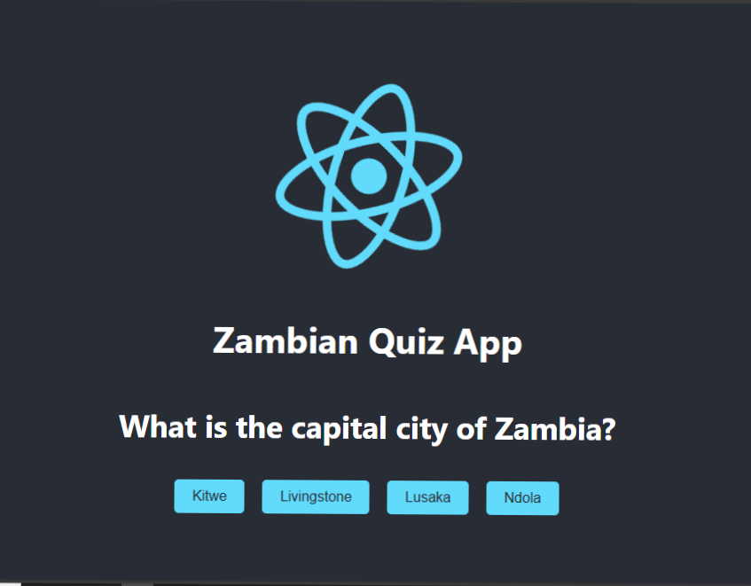

# Zambian Quiz App

A fun and interactive multiple-choice quiz app about Zambia's history, culture, and geography, built with React.

## Features

- **Interactive Quiz:** Answer multiple-choice questions about Zambia.
- **Scoring System:** Keeps track of your score.
- **Play Again Option:** Reset the quiz and try again.
- **Professional Design:** A clean and modern user interface with gradient background and hover effects.

## Demo



## Technologies Used

- React.js
- CSS for styling

## Getting Started

Follow these instructions to set up and run the app on your local machine.

### Prerequisites

Make sure you have the following installed:

- [Node.js](https://nodejs.org/) (v14 or later)
- [npm](https://www.npmjs.com/) (comes with Node.js)

### Installation

1. Clone the repository:
   ```bash
   git clone https://github.com/your-username/zambian-quiz-app.git
   cd zambian-quiz-app
